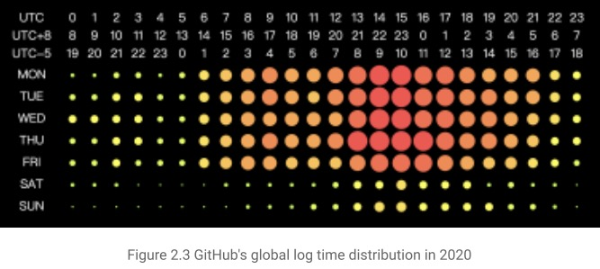
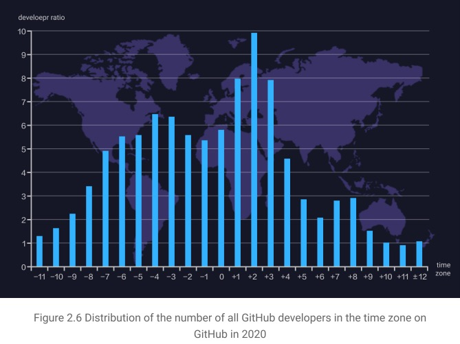
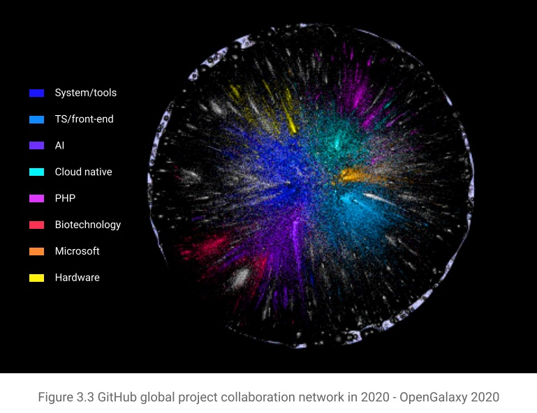
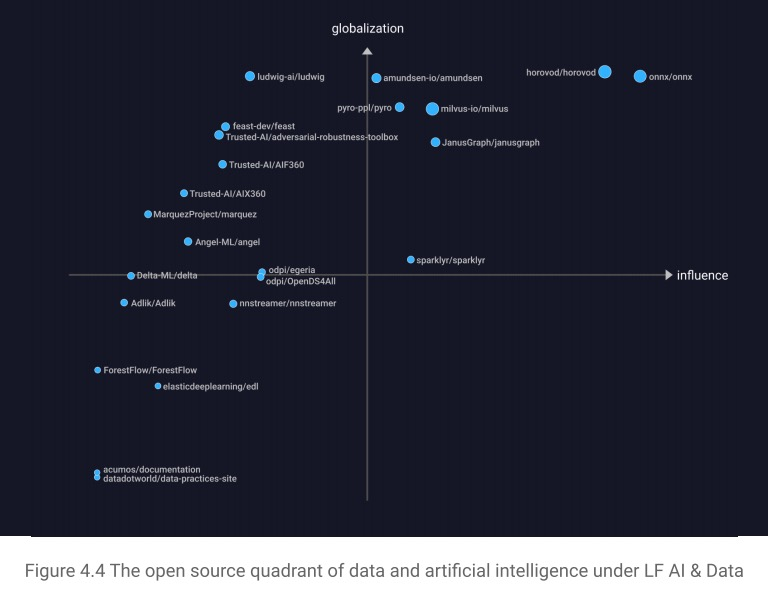

## **Check Out The GitHub 2020 Digital Insight Report!**

By Xiaoya

This is a report produced by [X-lab](http://www.x-lab.info/) and jointly completed with several scientific institutions. We wish to share the insights and metrics that were digged out through GitHub collaboration data with CHAOSS.

Open source software has become a cornerstone of our digital world, and open collaboration plays an enormous role in the development of human digital civilization.

**GitHub**, the world's largest open source collaboration platform, produced a massive amount of developer behavior data.

We obtained **860 million** event logs generated in 2020 and analyzed **14.54 million** active developers and **54.21 million** active projects.

What have we learned?

Please read our [GitHub 2020 Digital Insight Report](http://oss.x-lab.info/github-insight-report-2020-en.pdf).

This report, which is also an open source project([GitHub Address](https://github.com/X-lab2017/github-analysis-report)), explores the status of global trends in open source. You will find an in-depth analysis of developers and projects, case studies, and insights about individual contribution patterns, group collaboration models, community health status, development trends, and business value.

Here are some highlights:

