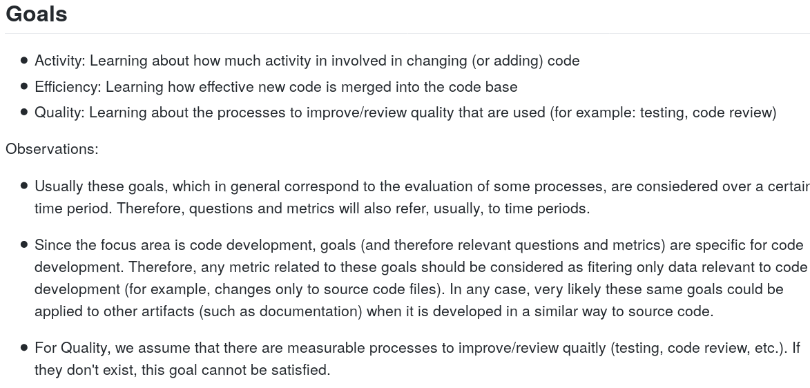
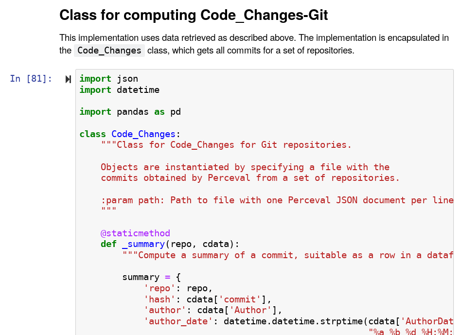

# How we produce metrics in the GMD Working Group

The [GMD Working Group](https://github.com/chaoss/wg-gmd)
is one of the CHAOSS working groups, tasked with defining
useful metrics relevant for the analysis of 
software development projects from the point of view of
GMD (growth-maturity-decline). It also works
in the areas of risk and value. For all of them, we're
intending to follow the same process to produce metrics,
similar to what other CHAOSS working grupos are doing.
This post describes this process, that we have recently
completed for the first metric (many others should follow
during the next weeks).

The process is top down, starting by the definition of 
the focus areas of interest. For each of the focus areas,
we define the goals we intend to reach for it, and then
we follow [GQM](https://en.wikipedia.org/wiki/GQM)
(goal-question-metric) to first derive questions which,
when answered, should help to reach our goals, and then
metrics that help to answer those questions.
Finally, we explore how those metrics could be implemented,
and produce reference implementations for specific data sources.
During all the process we have into account
[use cases](https://github.com/chaoss/wg-gmd/tree/master/use_cases),
which illustrate how metrics are used in the real world.

Currently, the working group is dealing with five
[focus areas](https://github.com/chaoss/wg-gmd/tree/master/focus_areas):
code development, community growth, issue resolution, risk, and value.
We estimate that all of them are relevant to improve our
knowledge of FOSS (free, open source software) projects.

For now, the more complete of these focus areas
is [code development](https://github.com/chaoss/wg-gmd/blob/master/focus_areas/code_development.md),
for which we have identified some goals: activity,
efficiency and quality. For each of them we're in the process
of identifying questions. For example for activity,
we have identified a question _"How many changes are happening to the code base, during a certain time period?"_,
code named `Changes`, that we think should help to learn about
the activity of a project.

To help to answer this question,
we have identified some metrics, such as
_"Number of changes to the code base"_, code named as
`Code_Changes_No(Period)`, which tries to capture
how many changes to the source code were done during the
period of interest.
We explain this in detail in the
[definition of the Code_Changes metric](https://github.com/chaoss/wg-gmd/blob/master/metrics/Code_Changes.md).
This definition tries to be neutral with respect to the
specific data source (in this case a source code management
repository, such as git, Subversion, or Mercurial),
but also includes specific sections for specific data sources.

Finally, to clarify the metric, and provide a definition which
is not ambiguous and can be checked for conformance,
we also provide an implementation of it for a certain data source.
In our case, we implemented
it for git, as a Python notebook
([check it in Binder](https://mybinder.org/v2/gh/chaoss/wg-gmd/master?filepath=implementations/Code_Changes-Git.ipynb)).
It includes documentation on the details of the implementation,
and an actual implementation of the metric as a Python class.
It also includes examples of how to use it with real repositories,
and an exploration of some details of the specific data source,
relevant for implementations and comparison between different implementations.
Reference implementations are based on
[Perceval](https://github.com/chaoss/grimoirelab-perceval) output, which is a collection of JSON documents,
one per item obtained from the data source, as much similar
as the data produced by the data source as possible.

When producing the first reference implementation for
`Code_Changes`, we completed the first full process,
from focus area and goal to questions and metrics.
Now, we intend to complete this process for the rest
of goals in all our focus areas. Do you want to join us in this travel?
If so, you are welcome! We are ready to review your pull requests,
and work with you towards having useful definitions and
implementations of metrics that help us all to better understand
FOSS projects.
