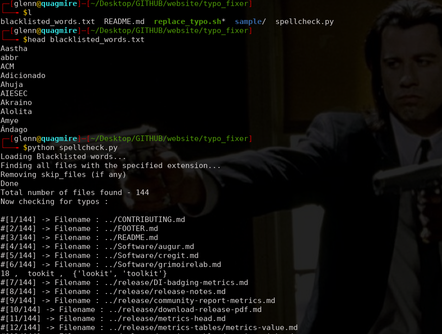
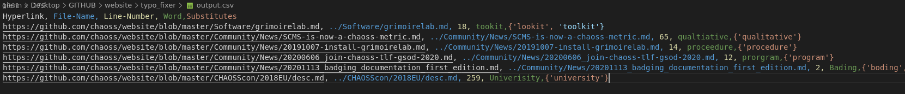
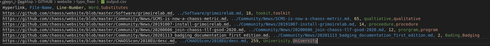
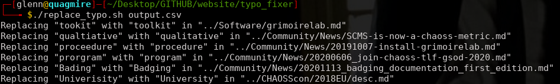

# Sample

**This folder contains screenshots of a test run for the scripts**

* Setting `blacklisted_words.txt` & then running `spellcheck.py` :

* Originally generated `output.csv` :

* `output.csv` after editing :

* Fixing typos : `./replace_typo.sh output.csv`

